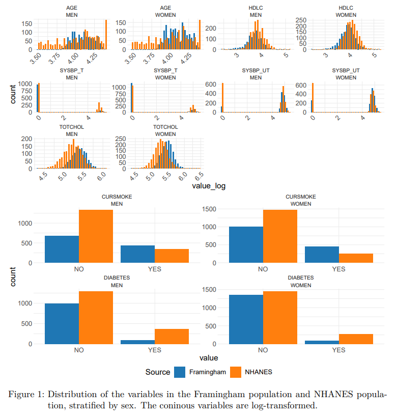
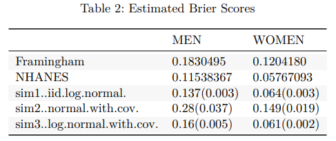

# Transportability Analysis of Cardiovascular Risk Prediction Models

This repository contains the resources and code used for conducting a
transportability analysis of cardiovascular risk prediction models.
Specifically, it examines the performance of a model developed using
data from the Framingham Heart Study when applied to a different
population represented in the NHANES dataset.

## Project Overview

The project explores the applicability and reliability of cardiovascular
risk models across diverse populations. By simulating data and
calculating Brier scores, the analysis provides insights into how the
distributional assumptions and the age variable affect the model's
transportability.

## Repository Structure

.

├── figures \# Figures and plots generated from the analysis
(placeholders included)
\
report.qmd \# qmd files 

report.pdf \# Final report document (PDF
format)

README.md

`report3.pdf`: Comprehensive report of the study's findings, including
methodology, results, and discussion.

## Data

The data used in this project is derived from two main sources:

The Framingham Heart Study dataset, which was used to develop the
original cardiovascular risk model. The NHANES (National Health and
Nutrition Examination Survey) dataset, which was used to test the
model's transportability.

## Key Components

**Data Processing**: Scripts for preparing and cleaning the Framingham
and NHANES datasets for analysis.

**Model Building**: Code for developing the cardiovascular risk
prediction model.

**Simulation Study**: Implementation of various simulation scenarios to
assess model transportability.

**Statistical Analysis**: Scripts for computing Brier scores and other
relevant metrics. Visualization: Code for generating plots and figures
to illustrate key findings.

## Figures

## Getting Started

To replicate the analysis, follow these steps:

-   Clone the repository to your local machine.
-   Ensure you have R and the necessary packages installed.
-   Run the qmd.

## Dependencies

R packages: dplyr, ggplot2, MASS, tableone.

## Acknowledgments

Dr. Jon Steingrimsson from the Biostatistics Department for collaboration.

The Framingham Heart Study for providing the dataset to develop the initial model.

The Centers for Disease Control and Prevention (CDC) for making the NHANES data publicly available.
